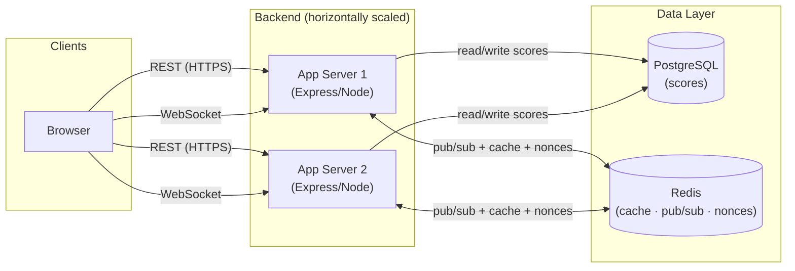
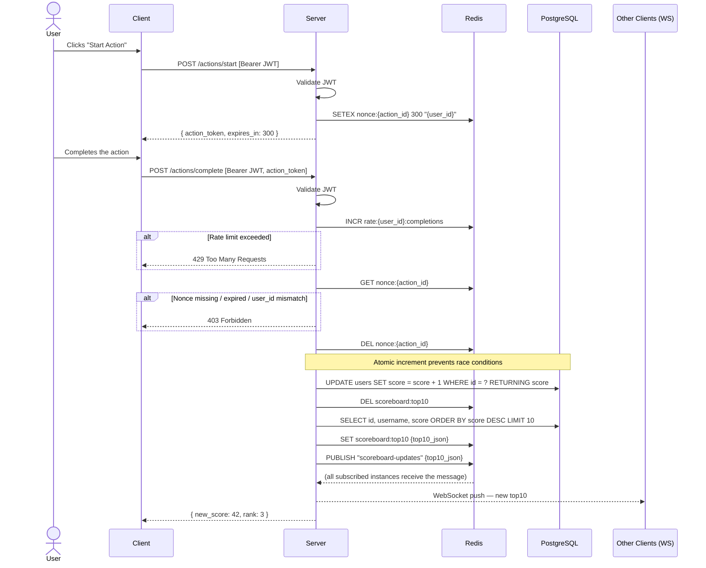
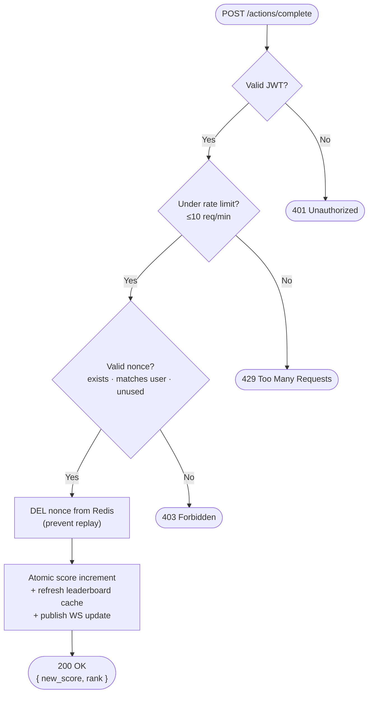

# Problem 6 — Scoreboard Module Specification

## Overview

This document specifies the **Scoreboard Module** — a backend component responsible for:

1. Receiving score-update requests from clients completing actions.
2. Persisting scores and maintaining a real-time Top-10 leaderboard.
3. Broadcasting live leaderboard changes to all connected clients.
4. Preventing unauthorised score manipulation.

---

## Table of Contents

- [System Requirements](#system-requirements)
- [Architecture](#architecture)
- [API Endpoints](#api-endpoints)
- [Security Model](#security-model)
- [Data Models](#data-models)
- [Diagrams](#diagrams)
- [Improvement Notes](#improvement-notes)

---

## System Requirements

| Requirement | Detail |
|---|---|
| Show top 10 users by score | Leaderboard sorted descending by `score` |
| Live update without page refresh | WebSocket push from server |
| Score increases on action completion | One action → one score increment |
| Prevent unauthorised score updates | JWT + action nonce + rate limiting |

---

## Architecture

The system is designed to be **stateless and horizontally scalable**. Redis serves as the shared backbone for caching, nonce storage, and cross-instance pub/sub.



---

## API Endpoints

### `POST /actions/start`

Called when a user **begins** an action. Returns a one-time action token.

**Auth:** Bearer JWT required.

**Response `200 OK`:**
```json
{
  "action_token": "eyJhbGciOiJIUzI1NiIsInR5cCI6IkpXVCJ9...",
  "expires_in": 300
}
```

The `action_token` is a signed nonce stored in Redis with a 5-minute TTL, encoding `{ user_id, action_id, iat, exp }`.

---

### `POST /actions/complete`

Called when the user **completes** the action. Validates the nonce and increments the score.

**Auth:** Bearer JWT required.

**Request body:**
```json
{ "action_token": "<token from /actions/start>" }
```

**Success `200 OK`:**
```json
{ "new_score": 42, "rank": 3 }
```

**Error responses:**

| Code | Reason |
|------|--------|
| `401` | Missing or invalid JWT |
| `400` | Missing `action_token` |
| `403` | Token already used, expired, or `user_id` mismatch |
| `429` | Rate limit exceeded |

---

### `GET /scoreboard/top10`

Returns the current Top-10. Served from Redis cache, invalidated on every score update.

**Auth:** None (public endpoint).

**Response `200 OK`:**
```json
{
  "updated_at": "2024-03-01T12:00:00.000Z",
  "entries": [
    { "rank": 1, "user_id": "u_abc", "username": "Alice", "score": 980 },
    { "rank": 2, "user_id": "u_def", "username": "Bob",   "score": 875 }
  ]
}
```

---

### WebSocket Event: `leaderboard_update`

Pushed to all connected clients whenever the Top-10 ranking changes (triggered by any score update).

**Event payload:**
```json
{
  "event": "leaderboard_update",
  "data": {
    "updated_at": "2024-03-01T12:00:05.000Z",
    "entries": [
      { "rank": 1, "user_id": "u_abc", "username": "Alice", "score": 981 },
      { "rank": 2, "user_id": "u_def", "username": "Bob",   "score": 875 }
    ]
  }
}
```

Clients should listen for this event on connection and update the leaderboard UI on receipt — no polling required.

---

## Security Model

| Layer | Mechanism | Purpose |
|---|---|---|
| 1 | **JWT Authentication** | Every mutating request requires a valid, non-expired Bearer token |
| 2 | **Action Nonce** | One-time token tied to a specific user + action; deleted from Redis immediately on use to prevent replay |
| 3 | **Rate Limiting** | Max 10 completions/minute per `user_id` via Redis sliding-window counter |
| 4 | **Input Validation** | All request bodies validated server-side; `action_token` signature verified — clients cannot forge it |

---

## Data Models

### `users` table (PostgreSQL)

| Column       | Type            | Notes               |
|--------------|-----------------|---------------------|
| `id`         | `UUID`          | Primary key         |
| `username`   | `VARCHAR`       | Unique, not null    |
| `score`      | `INTEGER`       | Default 0, not null |
| `created_at` | `TIMESTAMPTZ`   |                     |
| `updated_at` | `TIMESTAMPTZ`   |                     |

**Index:** `CREATE INDEX idx_users_score ON users (score DESC);`
Makes the Top-10 query (`ORDER BY score DESC LIMIT 10`) O(K) instead of O(N log N).

### Redis Keys

| Key pattern | Type | TTL | Purpose |
|---|---|---|---|
| `nonce:{action_id}` | String | 5 min | One-time action token |
| `rate:{user_id}:completions` | String | 60 sec | Rate limit sliding counter |
| `scoreboard:top10` | String (JSON) | Invalidated on write | Cached leaderboard |

---

## Diagrams

### Score Update — Sequence Diagram



---

### Security Validation — Flow Diagram



---

## Improvement Notes

1. **Idempotency & atomic score increment**
   The score update must be **atomic and idempotent**. A naive approach — read score → increment in memory → write back — creates a race condition: if the same user fires the API twice simultaneously (e.g., via a script or double-tap), both reads get the old value and both writes increment from the same base, causing only one point to be credited instead of two. The correct approach is a single atomic DB statement:
   ```sql
   UPDATE users SET score = score + 1 WHERE id = ? RETURNING score;
   ```
   Combined with the one-time nonce (deleted before the UPDATE), each action can only ever produce exactly one score increment, regardless of concurrent retries.

2. **Redis Sorted Set for scalable leaderboard**
   Replace `ORDER BY score DESC LIMIT 10` with a Redis Sorted Set (`ZADD users:scores <score> <user_id>` / `ZREVRANGE users:scores 0 9 WITHSCORES`). This gives O(log N) score updates and O(K) Top-K reads, far more efficient as the user base grows.

3. **WebSocket reconnect & rehydration**
   Clients should implement exponential backoff on disconnect. On reconnect, the server should immediately push the current Top-10 so the client never displays stale data.

4. **Server-side action verification**
   Before issuing the nonce, validate that the action is actually completable by the user (e.g., check game state, cooldowns, time constraints) rather than only verifying the token post-completion.

5. **Audit log**
   Persist every score change as `(user_id, delta, action_id, timestamp, ip_address)` in a separate `score_events` table. Enables post-hoc fraud analysis and targeted score rollbacks without modifying the primary `users` record.

6. **CQRS-lite for read scaling**
   Route `GET /scoreboard/top10` through a PostgreSQL read replica. All score writes go only to the primary, reducing contention under high concurrent traffic.
